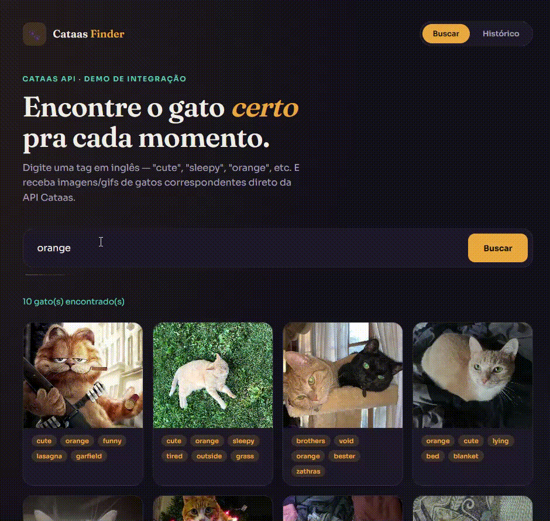

# Cataas Finder 🐱

Aplicação full stack para buscar imagens de gatos por tags, usando a [Cataas API](https://cataas.com/). O projeto integra um frontend estático em HTML, CSS e JavaScript com uma API REST em ASP.NET Core, que consulta o serviço externo e registra o histórico das buscas em SQLite.


Este repositório foi feito para representar meu aprendizado e portfólio com o ecossistema .NET. O foco é demonstrar integração com API externa, separação de responsabilidades, DTOs, injeção de dependência, Entity Framework Core, migrations e deploy.

**Acesso pelo link do GitHubPages** https://guilhermebt1.github.io/cataas-api-.net/

## O que a aplicação faz hoje

- Busca imagens de gatos a partir de uma tag, como `cute`, `orange` ou `sleepy`. SOMENTE EM INGLÊS
- Consulta a Cataas API sem expor diretamente o contrato externo ao frontend.
- Exibe as imagens retornadas em uma grade, com suas tags.
- Salva o termo, data e quantidade de resultados das últimas buscas.
- Exibe as dez buscas mais recentes.
- Trata termos vazios com uma resposta `400 Bad Request`.

## Tecnologias e por quê

| Camada | Tecnologia | Motivo da escolha |
|---|---|---|
| Frontend | HTML, CSS e JavaScript | Uma interface leve para praticar consumo de API com `fetch`. |
| Backend | ASP.NET Core 10 | Plataforma para criar a API REST, com injeção de dependência e middleware. |
| Integração externa | `HttpClient` tipado | Centraliza a comunicação assíncrona com a Cataas API. |
| Dados | Entity Framework Core 10 | Mapeia a entidade de histórico e controla o banco com migrations. |
| Banco | SQLite | Banco local em arquivo, simples para o escopo do projeto. |
| Documentação local | OpenAPI + Scalar | Interface para explorar a API durante o desenvolvimento. |
| Deploy | GitHub Pages + Render | Hospedagem do frontend estático e da API .NET. |

## Como as partes se conectam

```text
GitHub Pages (HTML/CSS/JavaScript)
              │ fetch / JSON
              ▼
API ASP.NET Core no Render
     │                    │
     │ HttpClient          │ Entity Framework Core
     ▼                    ▼
Cataas API             SQLite
```

O controller recebe a requisição do frontend. O `SearchService` normaliza o termo, coordena a busca e salva o histórico. O `CataasApiClient` é responsável apenas por chamar a API externa. Antes de devolver os dados, a aplicação transforma o DTO recebido do Cataas em um DTO próprio.

## Estrutura do repositório

```text
docs/                         # frontend publicado no GitHub Pages
  index.html                  # interface, estilos e chamadas fetch

CataasAPIWeb/CataasApi/       # API ASP.NET Core
  Controllers/                # endpoints HTTP
  Data/                       # AppDbContext
  DTOs/                       # contratos interno, externo e de resposta
  Interfaces/                 # contratos dos serviços
  Models/                     # entidade SearchHistory
  Services/                   # regras de negócio e cliente Cataas
  Migrations/                 # histórico versionado do banco
  Dockerfile                  # imagem usada pelo Render
```

## Decisões de implementação

### 1. Separar o contrato da Cataas do contrato da aplicação

`CataasCatDto` representa o JSON retornado pela Cataas. Ele não é enviado diretamente ao frontend. O serviço converte cada item em `ImagemDTO`, que contém somente o que a interface precisa: identificador, tags, tipo do arquivo e URL da imagem.

```text
Cataas API → CataasCatDto → SearchService → ImagemDTO → Frontend
```

Essa separação reduz o acoplamento: mudanças no formato da API externa não precisam alterar automaticamente a resposta da minha API.

### 2. Usar `HttpClient` tipado e injeção de dependência

O `CataasApiClient` implementa a interface `ICataasApi`. O `SearchService` depende da interface, e não da implementação concreta. Assim, a montagem da URL e a chamada HTTP ficam isoladas e o serviço de busca pode ser testado ou alterado com mais facilidade.

### 3. Persistir o histórico com EF Core e SQLite

A entidade `SearchHistory` registra o termo pesquisado, a data/hora e a quantidade de imagens retornadas. O `AppDbContext` expõe a tabela pelo `DbSet<SearchHistory>`.

As migrations são aplicadas na inicialização da API, o que permite ao container do Render criar a estrutura do banco ao subir.

> No plano gratuito do Render, o sistema de arquivos é temporário. Portanto, o histórico pode ser apagado quando o serviço reinicia ou recebe um novo deploy. Isso é aceitável neste projeto porque o histórico não contém dados essenciais do usuário.

### 4. Limitar origens permitidas com CORS

O frontend é hospedado em um domínio diferente da API. Por isso, o backend libera somente as origens locais de desenvolvimento e o GitHub Pages, em vez de usar `AllowAnyOrigin()`.

```csharp
policy.WithOrigins(
        "http://127.0.0.1:5500",
        "https://guilhermebt1.github.io")
    .WithMethods("GET")
    .AllowAnyHeader();
```

## Endpoints

| Método | Rota | Descrição |
|---|---|---|
| `GET` | `/api/search?termo={tag}` | Busca até dez imagens relacionadas à tag e registra a busca. |
| `GET` | `/api/search/history` | Retorna as dez buscas mais recentes. |

Exemplo:

```text
GET /api/search?termo=orange
```

## Meus próximos passos com o projeto

- Adicionar uma busca aleatória de gatos.
- Permitir seleção de várias tags pela interface.
- Padronizar falhas externas com `ProblemDetails`.
- Criar testes automatizados para o `SearchService`.
- Substituir o SQLite por um banco persistente se o histórico se tornar relevante.
- Adicionar cache para buscas repetidas.

## Aprendizados demonstrados 👨🏻‍💻

Com esse projeto exercitei conceitos como: consumo de API externa, operações assíncronas, DTOs, injeção de dependência, camadas de serviço, Entity Framework Core, SQLite, migrations, CORS, tratamento de erros, Docker e deploy de uma aplicação full stack.

Desenvolvido por Guilherme como projeto de estudo e portfólio.
